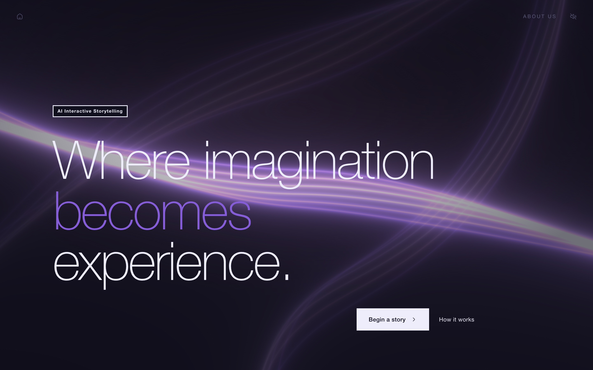
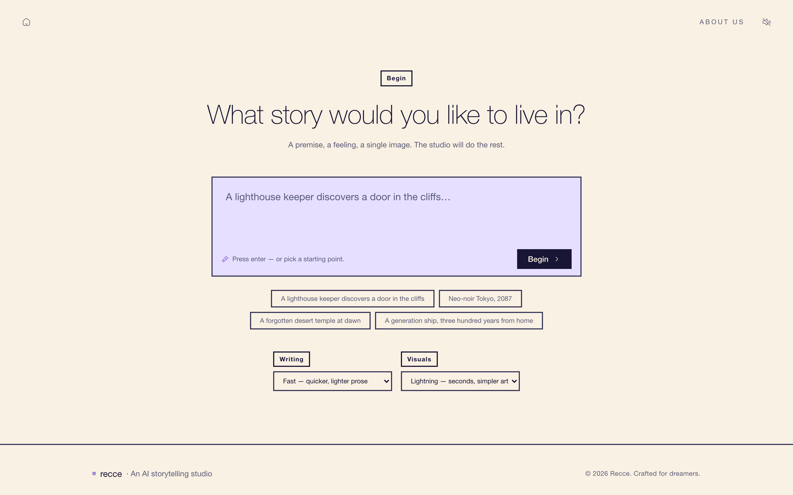
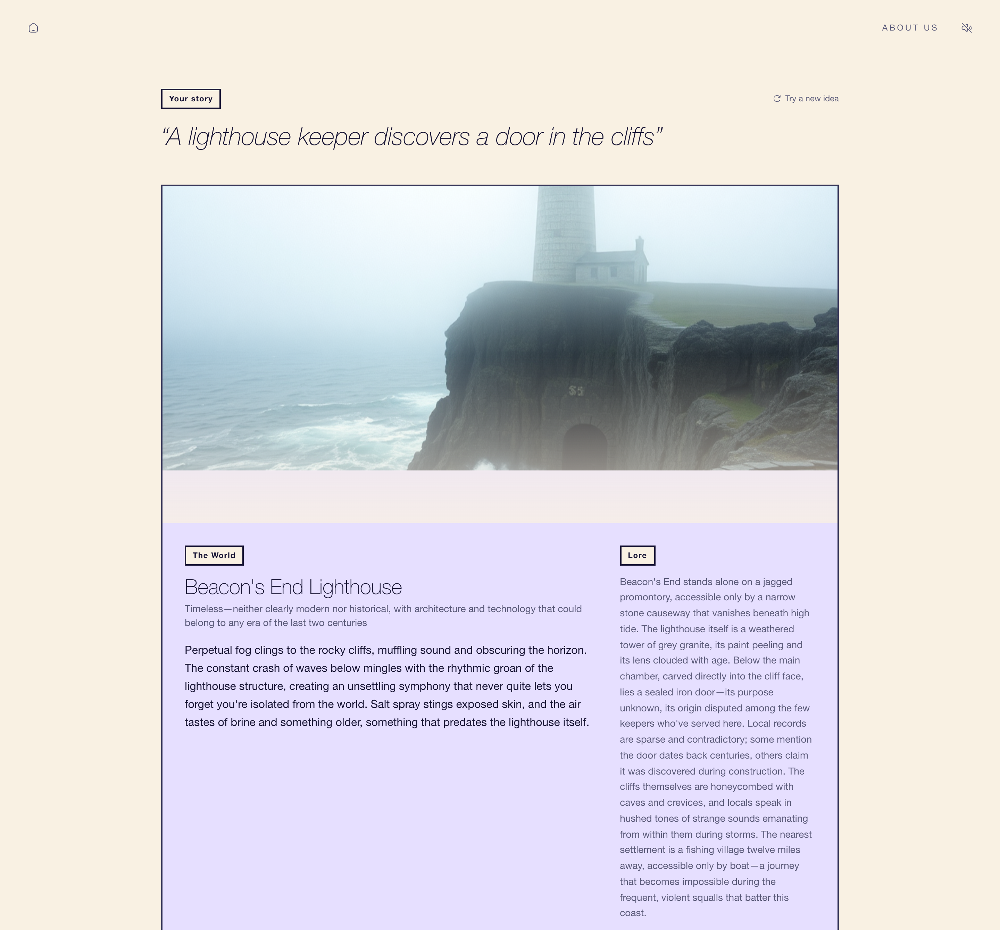
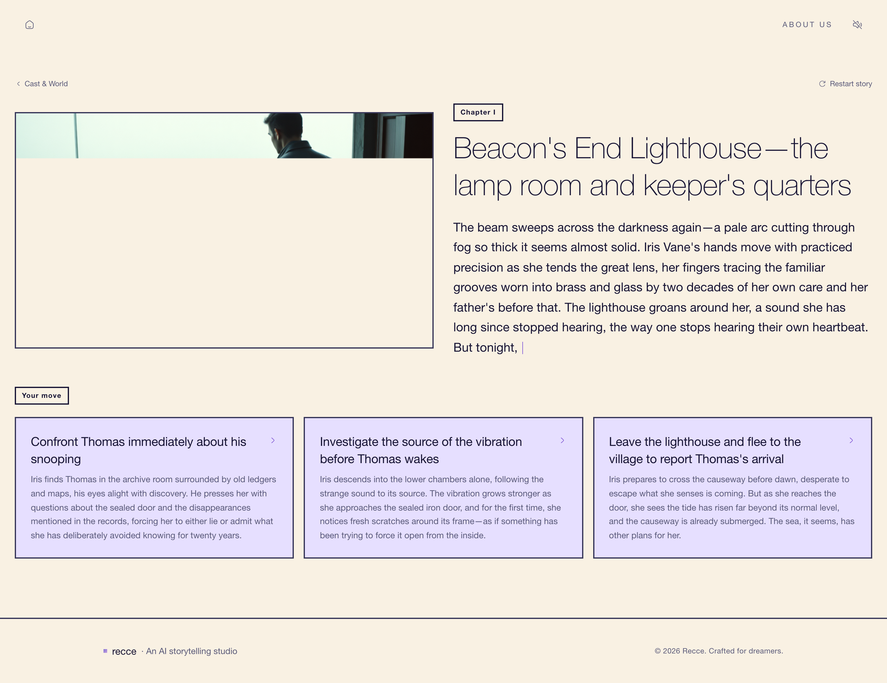
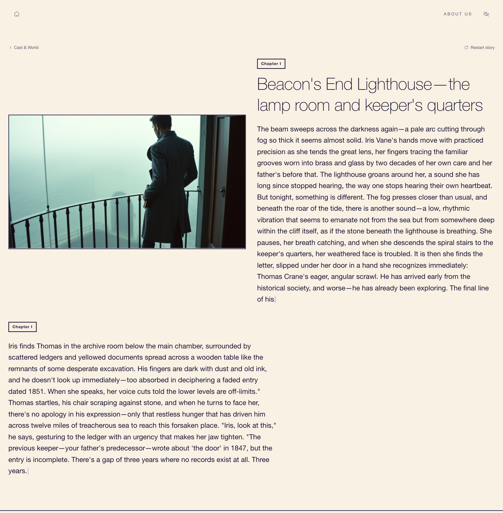

<div align="center">



# Recce

### Where imagination becomes experience.

**An AI-powered interactive storytelling studio.** Bring a single movie idea and Recce builds the whole world around it — a cast with backstories, a designed world, generated visuals, and a choice-driven, playable narrative.

[Repository](https://github.com/tugaep/recce-web) · [Blog post](https://medium.com/@ranakara2002/where-imagination-becomes-experience-recce-6e4f316c674a) · [Demo walkthrough](#-the-demo-scenario) · [Run it locally](#-running-it-locally) · [Get a fal API key](#-getting-your-own-fal-credentials)

</div>

---

## What is Recce?

> _A **recce** is the location scout a director runs before principal photography. We borrowed the term._

Most people have raw, creative movie ideas but lack the technical skills, resources, or collaborators to bring them to life. Recce removes every barrier between imagination and experience — anyone with an idea can instantly step into a fully realized, interactive cinematic world.

You type a premise. A studio of AI agents handles casting, world-building, and the script alongside you, then streams back a playable scene. You make a choice; the next scene rewrites around it.

Recce started with a simple belief: the gap between a story idea and a playable, cinematic world should be measured in **seconds, not years** of creative or technical effort. It was developed as part of our Data Science course, exploring how generative AI can transform ideas into interactive storytelling experiences.

> **Our mission:** No idea is too small to become a world. Break down the barriers between imagination and creation by turning simple ideas into immersive, interactive experiences — no technical skills, production resources, or specialized knowledge required.

### The problem it solves

| You have… | Recce gives you… |
|---|---|
| "I have a movie idea but can't execute it" | You input the idea; AI builds the full world around it |
| No characters or cast | Characters with names, looks, backstories & personalities |
| No script or story structure | A dynamic, choice-driven screenplay |
| No visual reference for settings | Generated images of locations and environments |
| A passive storytelling experience | You **play** as a character, making choices that alter the narrative |
| The high cost of film/game production | Zero cost barrier — anyone can create and experience their story |

Recce sits at the crossroads of **generative AI**, **interactive entertainment / game design** (choice-driven narrative, like a Visual Novel), **creative writing & screenwriting**, **UX / product design**, and **film & media production**.

---

## 🎬 The demo scenario

A full playthrough from one line: _"A lighthouse keeper discovers a door in the cliffs."_

### 1. Bring a logline

A premise, a feeling, or a single image is enough. Pick how rich the writing and visuals should be (longer wait = richer output).



### 2. Scout the generated world

While the studio is still writing, the world and principal cast stream in — the World Builder delivers a location with production-design notes and lore, and the Character Designer drafts a cast (each with a backstory and a generated portrait).



### 3. Roll the scene, then decide

Read the scene, then choose. Every choice is a branch — pick one and the next beat is written around it.



### 4. The story rewrites around your choice

The next chapter streams in, shaped by what you decided.



When the story ends, you get a full recap of your path — and can optionally request a literary editor's review of character consistency, narrative arc, and craft.

---

## 🧠 How it works

A typical run through the system:

1. You type a movie idea on the React frontend, which opens a **WebSocket** to the FastAPI backend.
2. The backend hands the idea to the **LangGraph orchestrator**, which runs the **Character Designer** and **World Builder** in parallel (Claude Sonnet 4.6).
3. Those outputs go to the **Visual Director**, which writes prompts for the **Character Portrait Artist** and **World & Environment Artist** — both call **gpt-image-2**; the resulting images are uploaded to storage.
4. The **Storyteller** writes the opening scene, the **Scene Composer** renders an illustration for it, and the **Judge** + **Visual Continuity Checker** validate everything.
5. The scene plus its choices stream back over the WebSocket to the frontend.
6. When you make a choice, that choice updates LangGraph's narrative state and the loop runs again.

LangGraph is the backbone of the agent layer: it models the workflow as a **state graph** where nodes are agents and edges are conditional transitions.

### The crew

Recce isn't one model doing every job — it's a crew of specialist agents, each running one department off the same script.

**Story agents**

| Agent | Model | Role |
|---|---|---|
| Orchestrator | Claude Sonnet 4.6 | Reads input, routes to specialists, manages the narrative state graph |
| Character Designer | Claude Sonnet 4.6 | Generates characters with names, backstories, personalities, descriptions |
| World Builder | Claude Sonnet 4.6 | Designs locations, time period, atmosphere, and the rules of the world |
| Storyteller | Claude Sonnet 4.6 | Writes scenes, dialogue, and the branching choices |
| Judge | Claude Sonnet 4.6 | Validates structure, coherence, continuity & safety before committing to state |

**Visual agents**

| Agent | Model | Role |
|---|---|---|
| Visual Director | Claude Sonnet 4.6 | Establishes the visual style guide and writes detailed image prompts |
| Character Portrait Artist | gpt-image-2 | Renders portraits and full-body shots of each character |
| World & Environment Artist | gpt-image-2 | Renders key locations — interiors, exteriors, landscapes, establishing shots |
| Scene Composer | gpt-image-2 | Renders pivotal moments, combining characters and environments into single frames |
| Visual Continuity Checker | Claude Sonnet 4.6 | Reviews each image against the style guide and flags inconsistent outputs |

---

## 🧱 Tech stack

**Frontend** — React 19 · Vite 7 · TypeScript · TanStack Start & Router · Tailwind CSS 4 · shadcn/ui · Vitest

**Backend** — Python 3.11+ · FastAPI · WebSockets · LangGraph (agent orchestration) · `fal-client`

**Models (all routed through [fal](https://fal.ai))** — Claude Sonnet 4.6 for every language task (via `openrouter/router`) · gpt-image-2 for every image task (via `fal-ai/gpt-image-2`)

**Data layer** — Supabase (PostgreSQL for narrative state & saved sessions, object storage for generated images) — *optional for local dev*

---

## 🚀 Running it locally

Recce has two parts: a **frontend** (Vite, port `8080`) and a **backend** (FastAPI, port `8000`). The frontend talks to the backend over a WebSocket, so you need both running to play a story.

### Prerequisites

- **[Bun](https://bun.sh)** (or Node 18+ with npm) for the frontend
- **Python 3.11+** for the backend
- A **fal API key** — [see below](#-getting-your-own-fal-credentials) (required; nothing generates without it)

### 1. Clone

```bash
git clone https://github.com/tugaep/recce-web.git
cd recce-web
```

### 2. Backend

```bash
cd backend

# create & activate a virtual environment
python -m venv venv
source venv/bin/activate          # Windows: venv\Scripts\activate

# install dependencies
pip install -r requirements.txt

# configure secrets
cp .env.example .env              # then edit .env and paste your FAL_KEY

# run it (WebSocket served at ws://localhost:8000/ws)
uvicorn main:app --reload --port 8000
```

Your `backend/.env` should look like this (only `FAL_KEY` is required to generate stories):

```ini
# fal — serves all model calls (Claude Sonnet 4.6 text + gpt-image-2 images)
FAL_KEY=your-fal-key-here

# Supabase — optional. Enables saved/shareable stories. Leave blank for local dev.
SUPABASE_URL=
SUPABASE_KEY=
```

<details>
<summary>Optional fal overrides (defaults shown)</summary>

```ini
# Text model — re-point if 4.6 is unavailable on fal/OpenRouter
# FAL_LLM_ENDPOINT=openrouter/router
# FAL_LLM_MODEL=anthropic/claude-sonnet-4.6
# FAL_LLM_MAX_TOKENS=4096

# Image generation — gpt-image-2 via fal
# FAL_IMAGE_MODEL=fal-ai/gpt-image-2
# FAL_IMAGE_QUALITY=low           # low | medium | high  (~27s / ~60s / ~140s per image)
# FAL_IMAGE_SIZE=landscape_4_3
```
</details>

### 3. Frontend

In a **second terminal**, from the repo root:

```bash
bun install
bun run dev          # → http://localhost:8080
```

> Using npm instead? `npm install && npm run dev`.

Open **http://localhost:8080**, click **Begin a story**, and type an idea (or pick a starting suggestion).

By default the frontend connects to `ws://localhost:8000/ws`. To point it elsewhere, set `VITE_WS_URL` (and optionally `VITE_API_URL`) in a root `.env` file.

### Frontend scripts

| Command | Description |
|---|---|
| `bun run dev` | Start the dev server on port 8080 |
| `bun run build` | Production build |
| `bun run preview` | Preview the production build |
| `bun run test` | Run the Vitest suite |
| `bun run lint` | Lint with ESLint |
| `bun run format` | Format with Prettier |

---

## 🔑 Getting your own fal credentials

Every model call — both the Claude Sonnet 4.6 text generation and the gpt-image-2 image generation — is routed through **[fal.ai](https://fal.ai)**, so a single fal API key is all you need.

1. Go to **[fal.ai](https://fal.ai)** and **sign up / sign in** (GitHub, Google, or email).
2. Open the API keys page: **[fal.ai/dashboard/keys](https://fal.ai/dashboard/keys)**.
3. Click **Add key** (or **Create API key**), give it a name, and **copy** the generated key — you'll only see the full value once.
4. Paste it into `backend/.env`:
   ```ini
   FAL_KEY=your-fal-key-here
   ```
5. Restart the backend. That's it — the same key powers both text and images.

> 💡 **Notes**
> - fal is **usage-based** — you're billed per generation. Check current rates on [fal.ai/pricing](https://fal.ai/pricing); new accounts typically include some trial credit.
> - To keep costs and wait times down while testing, use the **Fast / Lightning** writing and visual presets on the start screen (or set `FAL_IMAGE_QUALITY=low`).
> - `backend/.env` is **gitignored** — never commit your real key.

---

## 📁 Project structure

```
recce-web/
├── src/                      # Frontend (TanStack Start + React)
│   ├── routes/               # /  (landing), /about, /demo
│   ├── components/           # site/, demo/, ui/ (shadcn)
│   ├── hooks/useWebSocket.ts # WebSocket client → backend
│   ├── data/mockStory.ts     # Offline fallback story (the lighthouse demo)
│   └── lib/                  # visual-state helpers
├── backend/                  # Python (FastAPI + LangGraph)
│   ├── main.py               # WebSocket server & pipeline wiring
│   ├── agents/               # Story + visual agents
│   ├── graph/                # LangGraph state graph
│   ├── llm/                  # fal model client
│   ├── db/                   # Supabase persistence
│   └── requirements.txt
└── docs/                     # README screenshots
```

---

## 👥 Team

Recce was built by two people who wanted the studio they wished existed.

| | Role |
|---|---|
| **Rana Kara** — [LinkedIn](https://www.linkedin.com/in/rana-karaa/) · [GitHub](https://github.com/ranakaraa) | Shapes the storytelling system — turning ideas into structured narratives and interactive experiences. |
| **Tuğrap Efe Dikpınar** — [Portfolio](https://tugrap.dev) · [LinkedIn](https://www.linkedin.com/in/tugrapefedikpinar/) · [GitHub](https://github.com/tugaep) | Focuses on the visual and user-experience side — bringing stories and worlds to life through design and interfaces. |

---

<div align="center">

**A logline is enough.**

_© 2026 Recce. Crafted for dreamers._

</div>
